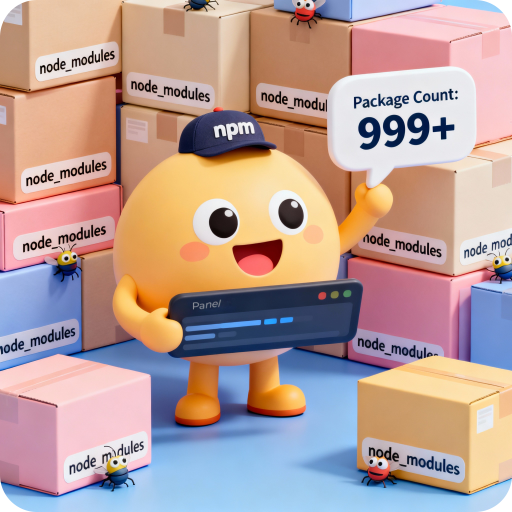

# 📦 node-modules-counter




A hilarious CLI tool that counts the number of packages in your `node_modules` directory and judges you for it. Because every developer needs a little shame in their life.

## 🎉 Features

- **Lightning-fast counting** - Instantly tells you how bloated your project is
- **Witty commentary** - Get roasted based on your package count
- **Global installation** - Run from anywhere with `count-modules`
- **Cross-platform** - Works on macOS, Linux, and Windows
- **Built with TypeScript** - Type-safe chaos

## 📊 What You'll Get

Run the command and receive:

- Total package count in your `node_modules`
- Motivational (or demotivational) messages based on your situation
- A laugh at how far JavaScript dependency culture has gone

## 📦 Installation

Install globally via npm:

```bash
npm install -g node-modules-counter
```

Or use it directly with npx:

```bash
npx node-modules-counter
```

## 🚀 Usage

Navigate to any project directory and run:

```bash
count-modules
```

### Example Output

```
🎉 You have 1247 packages in node_modules! 🎉
😱 This is INSANITY! Maybe it's time for a dependency detox?
```

## 📈 What the Messages Mean

- **1-100 packages**: `✨ Minimalist project - respect!`
- **100-500 packages**: `👍 Pretty normal for JavaScript!`
- **500-1000 packages**: `🤔 That's a lot... but could be worse!`
- **1000+ packages**: `😱 This is INSANITY! Maybe it's time for a dependency detox?`

## 🛠️ Development

### Prerequisites

- Node.js 16+
- npm or yarn

### Setup

Clone the repository and install dependencies:

```bash
git clone <repository-url>
cd node-modules-counter
npm install
```

### Build

Compile TypeScript to JavaScript:

```bash
npm run build
```

### Test Locally

Link the package globally for local testing:

```bash
npm link
count-modules
```

### Unlink

When you're done testing:

```bash
npm unlink -g node-modules-counter
```

## Project Structure

```
node-modules-counter/
├── src/
│   └── index.ts          # Main CLI logic
├── dist/                 # Compiled JavaScript (generated)
├── package.json          # Project metadata
├── tsconfig.json         # TypeScript configuration
└── README.md            # This file
```

## Why No Bundler?

This project intentionally uses **no bundler** (no Webpack, Vite, or Parcel). Here's why:

- **Simplicity**: Direct TypeScript compilation is faster and easier to maintain
- **Performance**: No unnecessary build complexity for a simple CLI tool
- **Minimal dependencies**: Fewer dependencies = fewer problems
- **Transparency**: Your code is clear and understandable

## How It Works

The tool:

1. Finds your project's `node_modules` directory
2. Counts all subdirectories (packages)
3. Displays the total with witty commentary
4. Silently judges your dependency choices

## Troubleshooting

### `command not found: count-modules`

Make sure the package is installed globally:

```bash
npm list -g node-modules-counter
```

If not installed, install it:

```bash
npm install -g node-modules-counter
```

### No `node_modules` found

The command searches for `node_modules` in the current working directory. Make sure you're running it in a Node.js project.

## Contributing

Found a bug? Have a hilarious message idea? Feel free to open an issue or submit a pull request!

## License

MIT License - Use it, modify it, share it. Just don't blame me for your dependency crisis.

## Disclaimer

This tool provides no actual solutions to JavaScript dependency bloat. It merely reflects your reality back at you with humor. For real solutions, consider:

- Using `npm prune` to remove unused dependencies
- Switching to `pnpm` for better package management
- Questioning your life choices when adding the 47th utility library

---

_Made with ❤️ (and probably too many dependencies)_
